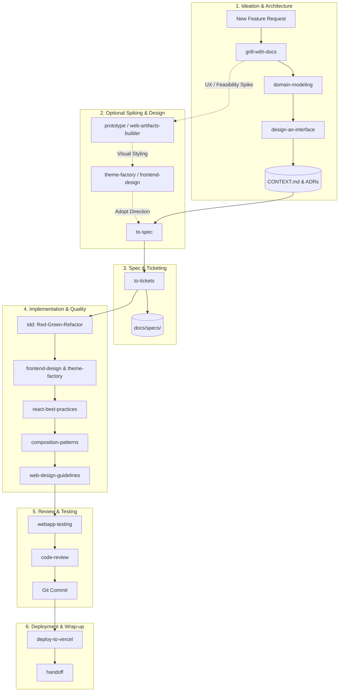

# Engineering Agent Workflows & Skill Reference Guide

This document outlines the disciplined engineering workflows, UI/UX craft guidelines, and agent skills configured for this repository. It serves as a persistent guide for developers and AI agents to ensure predictable, high-quality, performant, aesthetically crafted, and test-driven software development.

---

## 🧭 Philosophy: Disciplined AI Engineering

Instead of unstructured "vibe coding" where an AI agent makes dozens of silent assumptions and writes code in a single unverified leap, this repository adopts a structured **human-in-the-loop pipeline**:

1. **Interrogate before implementing**: Expose edge cases, trade-offs, and failure modes first.
2. **Document in real-time**: Keep domain vocabulary, invariants, and architecture decisions stored in version-controlled markdown files (`CONTEXT.md`, `docs/adr/`).
3. **Specify & ticket**: Deconstruct features into atomic, testable vertical slices (tracer bullets).
4. **Test-first execution**: Build behavior with strict Red-Green-Refactor cycles at public seams.
5. **Visual Craft & Aesthetics**: Commit to bold, intentional art direction, tactile depth, and distinctive typography while avoiding generic "AI slop".
6. **Frontend Excellence**: Enforce zero-waterfall React performance, modern component composition, and accessible UI design.
7. **Quality gates**: Review code against explicit checklists before merging.

---

## 🔄 Core Engineering Workflows



---

## 📚 Complete 22-Skill Catalog

All skills are stored in [`.agents/skills/`](file:///c:/Users/Owner/projects/sam-johnson-portfolio/.agents/skills/) and automatically discovered by Antigravity:

| Category | Skill Name | Trigger / Purpose | Primary Output / Action |
| :--- | :--- | :--- | :--- |
| **Process & Planning** | [`grill-with-docs`](file:///c:/Users/Owner/projects/sam-johnson-portfolio/.agents/skills/grill-with-docs/SKILL.md) | Early feature planning, design discussions | Writes decisions to `CONTEXT.md` & `docs/adr/` |
| | [`domain-modeling`](file:///c:/Users/Owner/projects/sam-johnson-portfolio/.agents/skills/domain-modeling/SKILL.md) | Resolving ambiguous terms, defining schemas | Updates `CONTEXT.md` glossary and invariants |
| | [`design-an-interface`](file:///c:/Users/Owner/projects/sam-johnson-portfolio/.agents/skills/design-an-interface/SKILL.md) | Designing module APIs ("Design It Twice") | Generates multiple divergent interface shapes |
| | [`to-spec`](file:///c:/Users/Owner/projects/sam-johnson-portfolio/.agents/skills/to-spec/SKILL.md) | Finalizing a feature design into a PRD | Generates `docs/specs/<feature>.md` |
| | [`to-tickets`](file:///c:/Users/Owner/projects/sam-johnson-portfolio/.agents/skills/to-tickets/SKILL.md) | Decomposing specs into tracer bullets | Sequence of atomic implementation tasks |
| | [`prototype`](file:///c:/Users/Owner/projects/sam-johnson-portfolio/.agents/skills/prototype/SKILL.md) | Quick exploratory spikes, UX mockups | Fast runnable prototype code |
| | [`handoff`](file:///c:/Users/Owner/projects/sam-johnson-portfolio/.agents/skills/handoff/SKILL.md) | Ending a work session or context reset | Concise handoff summary with next steps |
| | [`writing-great-skills`](file:///c:/Users/Owner/projects/sam-johnson-portfolio/.agents/skills/writing-great-skills/SKILL.md) | Authoring or updating agent skills | Guidelines and templates for new skills |
| **Visual Design & Aesthetics** | [`frontend-design`](file:///c:/Users/Owner/projects/sam-johnson-portfolio/.agents/skills/frontend-design/SKILL.md) | Crafting memorable, high-aesthetic web UI | Enforces bold art direction, textures, and typography |
| | [`theme-factory`](file:///c:/Users/Owner/projects/sam-johnson-portfolio/.agents/skills/theme-factory/SKILL.md) | Curated color palettes & font pairings | Applies cohesive 5-color palettes and type themes |
| | [`web-artifacts-builder`](file:///c:/Users/Owner/projects/sam-johnson-portfolio/.agents/skills/web-artifacts-builder/SKILL.md) | Building rich standalone HTML/React widgets | Generates self-contained interactive web apps |
| **Frontend Engineering** | [`react-best-practices`](file:///c:/Users/Owner/projects/sam-johnson-portfolio/.agents/skills/react-best-practices/SKILL.md) | React/Next.js performance optimization | Eliminates waterfalls, optimizes bundles & RSCs |
| | [`composition-patterns`](file:///c:/Users/Owner/projects/sam-johnson-portfolio/.agents/skills/composition-patterns/SKILL.md) | Scalable React component architecture | Compound components, slots, eliminates prop bloat |
| | [`web-design-guidelines`](file:///c:/Users/Owner/projects/sam-johnson-portfolio/.agents/skills/web-design-guidelines/SKILL.md) | UI/UX design, spacing & accessibility | 4px/8px rhythm, WCAG AA contrast, CLS prevention |
| **Testing & Execution** | [`tdd`](file:///c:/Users/Owner/projects/sam-johnson-portfolio/.agents/skills/tdd/SKILL.md) | Building features or bug fixes test-first | Failing test $\rightarrow$ passing code $\rightarrow$ refactor |
| | [`diagnosing-bugs`](file:///c:/Users/Owner/projects/sam-johnson-portfolio/.agents/skills/diagnosing-bugs/SKILL.md) | Investigating stack traces, regressions | Root-cause analysis & reproduction test |
| | [`webapp-testing`](file:///c:/Users/Owner/projects/sam-johnson-portfolio/.agents/skills/webapp-testing/SKILL.md) | End-to-end web browser testing | Automated headless Playwright/Vitest browser tests |
| | [`improve-codebase-architecture`](file:///c:/Users/Owner/projects/sam-johnson-portfolio/.agents/skills/improve-codebase-architecture/SKILL.md) | Refactoring tech debt, decoupling layers | Module audit & safe step-by-step refactoring |
| | [`code-review`](file:///c:/Users/Owner/projects/sam-johnson-portfolio/.agents/skills/code-review/SKILL.md) | Pre-commit / pre-PR sanity audits | Checklist review report (Blockers & Suggestions) |
| **Tools & Infrastructure** | [`mcp-builder`](file:///c:/Users/Owner/projects/sam-johnson-portfolio/.agents/skills/mcp-builder/SKILL.md) | Authoring custom Model Context Protocol servers | Builds TypeScript/Python MCP servers for APIs |
| | [`deploy-to-vercel`](file:///c:/Users/Owner/projects/sam-johnson-portfolio/.agents/skills/deploy-to-vercel/SKILL.md) | Deploying apps and preview builds to Vercel | Triggers preview/production deployments |
| **Token Efficiency** | [`caveman`](file:///c:/Users/Owner/projects/sam-johnson-portfolio/.agents/skills/caveman/SKILL.md) | Ultra-terse, low-token communication | Strips filler/pleasantries, saves ~65% output tokens |

---

## 📁 Repository Documentation Conventions

```text
├── CONTEXT.md                    # Project-wide ubiquitous language, entity definitions & invariants
├── docs/
│   ├── ENGINEERING_WORKFLOWS.md  # This reference guide
│   ├── adr/                      # Architecture Decision Records (e.g. 0001-use-drizzle.md)
│   └── specs/                    # Feature specifications & PRDs (e.g. auth-system.md)
└── .agents/
    └── skills/                   # Antigravity skill definitions (22 SKILL.md files)
```

---

## ⚡ How to Trigger Skills in Antigravity

1. **Progressive Disclosure (Autonomous)**:  
   Antigravity scans the YAML frontmatter (`name` and `description`) of all skills in `.agents/skills/`. When you request a task that matches a skill's description, Antigravity dynamically loads that skill.
2. **Explicit Prompts**:  
   You can directly invoke any workflow by name:
   * *"Style this section using `frontend-design` and `theme-factory`."*
   * *"Use `design-an-interface` to explore 3 alternative shapes for this module."*
   * *"Test this flow using `webapp-testing`."*
   * *"Deploy a preview using `deploy-to-vercel`."*
   * *"Create an MCP server for this API with `mcp-builder`."*
   * *"Activate `caveman` mode for fast concise replies."*
