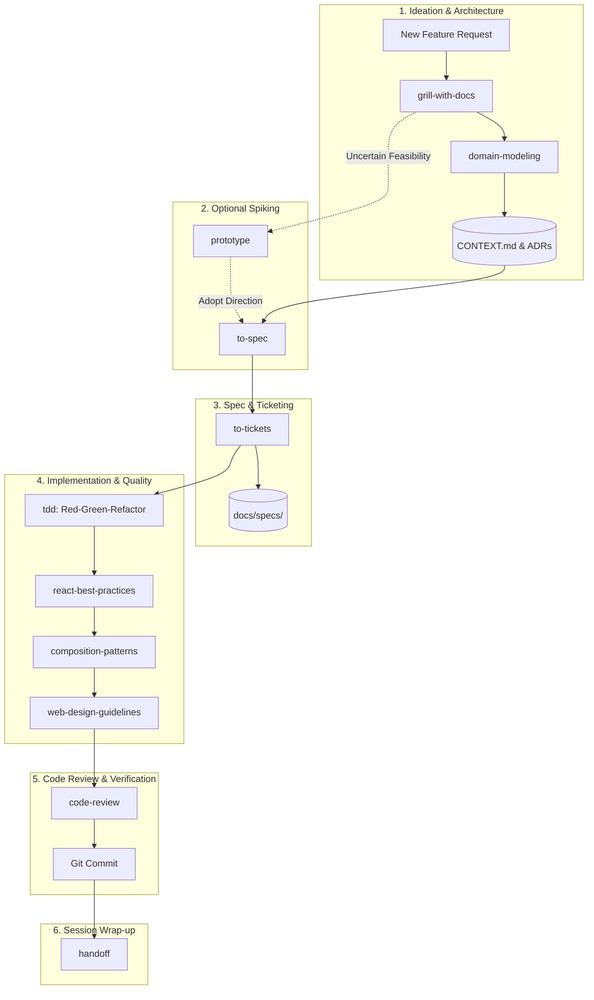

# Engineering Agent Workflows & Skill Reference Guide

This document outlines the disciplined engineering workflows and agent skills configured for this repository. It serves as a persistent guide for developers and AI agents to ensure predictable, high-quality, performant, and test-driven software development.

---

## 🧭 Philosophy: Disciplined AI Engineering

Instead of unstructured "vibe coding" where an AI agent makes dozens of silent assumptions and writes code in a single unverified leap, this repository adopts a structured **human-in-the-loop pipeline**:

1. **Interrogate before implementing**: Expose edge cases, trade-offs, and failure modes first.
2. **Document in real-time**: Keep domain vocabulary, invariants, and architecture decisions stored in version-controlled markdown files (`CONTEXT.md`, `docs/adr/`).
3. **Specify & ticket**: Deconstruct features into atomic, testable vertical slices (tracer bullets).
4. **Test-first execution**: Build behavior with strict Red-Green-Refactor cycles at public seams.
5. **Frontend Excellence**: Enforce zero-waterfall React performance, modern component composition, and accessible UI design.
6. **Quality gates**: Review code against explicit checklists before merging.

---

## 🔄 Core Engineering Workflows



---

### Workflow A: New Feature Development (Idea $\rightarrow$ Production)

Use this complete pipeline when building new user-facing features, APIs, or data models.

| Phase | Skill | Primary Actions | Artifacts Produced / Modified |
| :--- | :--- | :--- | :--- |
| **1. Explore & Stress-Test** | `grill-with-docs` | Interrogates you on requirements, failure states, and architecture trade-offs branch-by-branch. | `CONTEXT.md`<br>`docs/adr/XXXX-*.md` |
| **2. Align Vocabulary** | `domain-modeling` | Enforces exact canonical names, entity lifecycles, and system invariants. | `CONTEXT.md` |
| **3. Spike (Optional)** | `prototype` | Fast disposable proof-of-concept to answer UX or technical unknowns. | Disposable spike files |
| **4. Formalize Spec** | `to-spec` | Synthesizes agreements into a formal PRD with acceptance criteria and schemas. | `docs/specs/<feature>.md` |
| **5. Decompose** | `to-tickets` | Breaks the spec into ordered, testable tracer-bullet tasks. | Actionable ticket list |
| **6. Build Test-First** | `tdd` | Implements each ticket using Red $\rightarrow$ Green $\rightarrow$ Refactor at public seams. | Code & Test files |
| **7. Optimize Frontend** | `react-best-practices` | Eliminates network waterfalls (`Promise.all`), keeps `'use client'` at leaves, and prevents re-renders. | React/Next.js files |
| **8. Structure Components** | `composition-patterns` | Uses compound components and slots to eliminate boolean prop explosion. | UI Components |
| **9. Polish UI & A11y** | `web-design-guidelines` | Enforces 4px/8px grid rhythm, WCAG AA contrast, focus rings, and CLS prevention. | Styles & Markup |
| **10. Quality Review** | `code-review` | Checks correctness, edge cases, type safety, and security. | Review findings |
| **11. State Handoff** | `handoff` | Serializes session progress, decisions, and immediate next steps. | Session summary |

---

### Workflow B: Systematic Bug Investigation & Resolution

Use this workflow when investigating unexpected errors, race conditions, or broken functionality.

```
[Bug Reported] 
     │
     ▼
[diagnosing-bugs] ──► 1. Redact sensitive secrets/PII
                  ──► 2. Build minimal isolated reproduction
                  ──► 3. Formulate & test hypotheses
                  ──► 4. Isolate root cause (no symptom-patching)
     │
     ▼
[tdd]             ──► 5. Convert reproduction into failing test (RED)
                  ──► 6. Apply minimal structural fix (GREEN)
                  ──► 7. Refactor & verify full test suite
     │
     ▼
[code-review]     ──► 8. Verify fix and prevent collateral regressions
```

---

### Workflow C: Architecture Refactoring & Tech Debt Reduction

Use this workflow when restructuring modules, eliminating circular dependencies, or splitting oversized files.

1. **Audit with `improve-codebase-architecture`**:
   - Inspect module boundaries, coupling, and layer separation (UI vs Domain vs DB).
   - Plan incremental migrations (Strangler Fig pattern) so existing tests never break.
2. **Refactor Components with `composition-patterns`**:
   - Break down monolithic components into compound primitives with clean slots.
3. **Record Decisions with `grill-with-docs`**:
   - Create an ADR in `docs/adr/` capturing why the architecture was changed.
4. **Execute Refactor with `tdd`**:
   - Run typecheckers (`tsc --noEmit`) and test suites after every single file migration.

---

## 📚 Complete Skill Catalog

All skills are stored in [`.agents/skills/`](file:///c:/Users/Owner/projects/sam-johnson-portfolio/.agents/skills/) and automatically discovered by Antigravity:

| Category | Skill Name | Trigger / Purpose | Primary Output / Action |
| :--- | :--- | :--- | :--- |
| **Process & Planning** | [`grill-with-docs`](file:///c:/Users/Owner/projects/sam-johnson-portfolio/.agents/skills/grill-with-docs/SKILL.md) | Early feature planning, design discussions | Writes decisions to `CONTEXT.md` & `docs/adr/` |
| | [`domain-modeling`](file:///c:/Users/Owner/projects/sam-johnson-portfolio/.agents/skills/domain-modeling/SKILL.md) | Resolving ambiguous terms, defining schemas | Updates `CONTEXT.md` glossary and invariants |
| | [`to-spec`](file:///c:/Users/Owner/projects/sam-johnson-portfolio/.agents/skills/to-spec/SKILL.md) | Finalizing a feature design into a PRD | Generates `docs/specs/<feature>.md` |
| | [`to-tickets`](file:///c:/Users/Owner/projects/sam-johnson-portfolio/.agents/skills/to-tickets/SKILL.md) | Decomposing specs into tracer bullets | Sequence of atomic implementation tasks |
| | [`prototype`](file:///c:/Users/Owner/projects/sam-johnson-portfolio/.agents/skills/prototype/SKILL.md) | Quick exploratory spikes, UX mockups | Fast runnable prototype code |
| | [`handoff`](file:///c:/Users/Owner/projects/sam-johnson-portfolio/.agents/skills/handoff/SKILL.md) | Ending a work session or context reset | Concise handoff summary with next steps |
| | [`writing-great-skills`](file:///c:/Users/Owner/projects/sam-johnson-portfolio/.agents/skills/writing-great-skills/SKILL.md) | Authoring or updating agent skills | Guidelines and templates for new skills |
| **Execution & Quality** | [`tdd`](file:///c:/Users/Owner/projects/sam-johnson-portfolio/.agents/skills/tdd/SKILL.md) | Building features or bug fixes test-first | Failing test $\rightarrow$ passing code $\rightarrow$ refactor |
| | [`diagnosing-bugs`](file:///c:/Users/Owner/projects/sam-johnson-portfolio/.agents/skills/diagnosing-bugs/SKILL.md) | Investigating stack traces, regressions | Root-cause analysis & reproduction test |
| | [`improve-codebase-architecture`](file:///c:/Users/Owner/projects/sam-johnson-portfolio/.agents/skills/improve-codebase-architecture/SKILL.md) | Refactoring tech debt, decoupling layers | Module audit & safe step-by-step refactoring |
| | [`code-review`](file:///c:/Users/Owner/projects/sam-johnson-portfolio/.agents/skills/code-review/SKILL.md) | Pre-commit / pre-PR sanity audits | Checklist review report (Blockers & Suggestions) |
| **Frontend & UI Excellence** | [`react-best-practices`](file:///c:/Users/Owner/projects/sam-johnson-portfolio/.agents/skills/react-best-practices/SKILL.md) | React/Next.js performance optimization | Eliminates waterfalls, optimizes bundles & RSCs |
| | [`composition-patterns`](file:///c:/Users/Owner/projects/sam-johnson-portfolio/.agents/skills/composition-patterns/SKILL.md) | Scalable React component architecture | Compound components, slots, eliminates prop bloat |
| | [`web-design-guidelines`](file:///c:/Users/Owner/projects/sam-johnson-portfolio/.agents/skills/web-design-guidelines/SKILL.md) | UI/UX design, spacing & accessibility | 4px/8px rhythm, WCAG AA contrast, CLS prevention |
| **Token Efficiency** | [`caveman`](file:///c:/Users/Owner/projects/sam-johnson-portfolio/.agents/skills/caveman/SKILL.md) | Ultra-terse, low-token communication | Strips filler/pleasantries, saves ~65% output tokens |

---

## 📁 Repository Documentation Conventions

This repository organizes agent and project memory into predictable paths:

```text
├── CONTEXT.md                    # Project-wide ubiquitous language, entity definitions & invariants
├── docs/
│   ├── ENGINEERING_WORKFLOWS.md  # This reference guide
│   ├── adr/                      # Architecture Decision Records (e.g. 0001-use-drizzle.md)
│   └── specs/                    # Feature specifications & PRDs (e.g. auth-system.md)
└── .agents/
    └── skills/                   # Antigravity skill definitions (SKILL.md files)
```

---

## ⚡ How to Trigger Skills in Antigravity

1. **Progressive Disclosure (Autonomous)**:  
   Antigravity scans the YAML frontmatter (`name` and `description`) of all skills in `.agents/skills/`. When you request a task that matches a skill's description, Antigravity dynamically loads that skill.
2. **Explicit Prompts**:  
   You can directly request any workflow by name:
   * *"Activate `caveman` mode for faster responses."*
   * *"Audit this page with `web-design-guidelines`."*
   * *"Refactor this component using `composition-patterns`."*
   * *"Check this data-fetching flow with `react-best-practices` to eliminate waterfalls."*
   * *"Let's do a `grill-with-docs` session on adding Stripe subscriptions."*
   * *"Implement Ticket 1 using `tdd`."*
   * *"Run `code-review` on my latest changes."*
